---
## Front matter
title: "Лабораторная работа №4"
subtitle: "Создание и процесс обработки программ на языке ассемблера NASM"
author: "Дмитрий Сергеевич Хохлов"

## Generic otions
lang: ru-RU
toc-title: "Содержание"

## Bibliography
bibliography: bib/cite.bib
csl: pandoc/csl/gost-r-7-0-5-2008-numeric.csl

## Pdf output format
toc: true # Table of contents
toc-depth: 2
lof: true # List of figures
lot: true # List of tables
fontsize: 12pt
linestretch: 1.5
papersize: a4
documentclass: scrreprt
## I18n polyglossia
polyglossia-lang:
  name: russian
  options:
	- spelling=modern
	- babelshorthands=true
polyglossia-otherlangs:
  name: english
## I18n babel
babel-lang: russian
babel-otherlangs: english
## Fonts
mainfont: PT Serif
romanfont: PT Serif
sansfont: PT Sans
monofont: PT Mono
mainfontoptions: Ligatures=TeX
romanfontoptions: Ligatures=TeX
sansfontoptions: Ligatures=TeX,Scale=MatchLowercase
monofontoptions: Scale=MatchLowercase,Scale=0.9
## Biblatex
biblatex: true
biblio-style: "gost-numeric"
biblatexoptions:
  - parentracker=true
  - backend=biber
  - hyperref=auto
  - language=auto
  - autolang=other*
  - citestyle=gost-numeric
## Pandoc-crossref LaTeX customization
figureTitle: "Рис."
tableTitle: "Таблица"
listingTitle: "Листинг"
lofTitle: "Список иллюстраций"
lotTitle: "Список таблиц"
lolTitle: "Листинги"
## Misc options
indent: true
header-includes:
  - \usepackage{indentfirst}
  - \usepackage{float} # keep figures where there are in the text
  - \floatplacement{figure}{H} # keep figures where there are in the text
---

# Цель работы

Освоение процедуры компиляции и сборки программ, написанных на ассемблере NASM

# Выполнение лабораторной работы

Создаю каталог для работы с программами на языке ассемблера NASM (рис. [-@fig:001]).

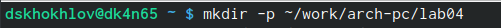{ #fig:001 width=70% }
 
Перехожу в созданный каталог (рис. [-@fig:002]).

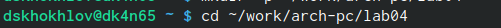{ #fig:002 width=70% }

Создаю файл с именем hello.asm (рис. [-@fig:003]).

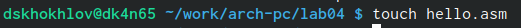{ #fig:003 width=70% }

Открываю файл с помощью тектового редактора gedit (рис. [-@fig:004]).

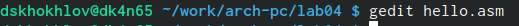{ #fig:004 width=70% }

Ввожу данные мне текст (рис. [-@fig:005]).

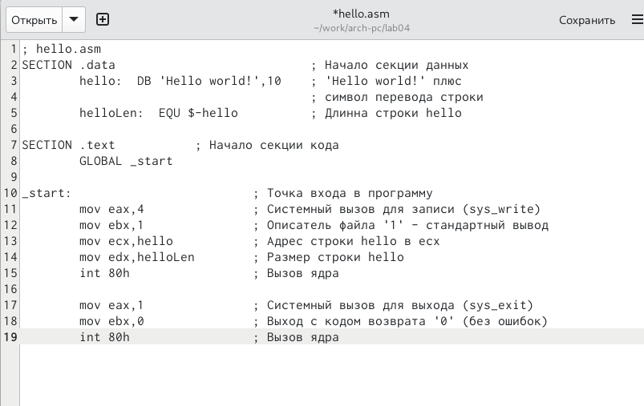{ #fig:005 width=70% }

Ввожу команду для компиляции текста программы "Hello world" (рис.6 [-@fig:006]).

{ #fig:006 width=70% }

Компилирую исходный файл hello.asm в obj.o (рис. [-@fig:007]).

{ #fig:007 width=70% }

Передаю объектный файл компановщику LD (рис. [-@fig:008]).

{ #fig:008 width=70% }

Аналогично ввожу следующую команду (рис. [-@fig:009]).

{ #fig:009 width=70% }

Запускаю исполняемый файл (рис. [-@fig:010]).

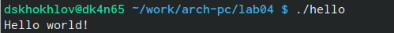{ #fig:010 width=70% }

#Выполнение самостоятельной работы

В каталоге ~/work/arch-pc/lab04 с помощью команды cp создаю копию файла
hello.asm с именем lab04.asm (рис. [-@fig:011]).

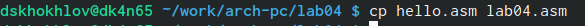{ #fig:011 width=70% }

С помощью текстого редактора gedit вношу изменения в текст программы lab04.asm так, тобы вместе с Hello world! на экран выводилась строка с моими фамилией и иминем (рис. [-@fig:012]).

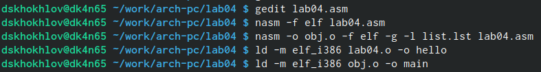{ #fig:012 width=70% }

Транслирую полученный текст программы lab04.asm в объектный файл. Выполняю
компоновку объектного файла (рис. [-@fig:013]).

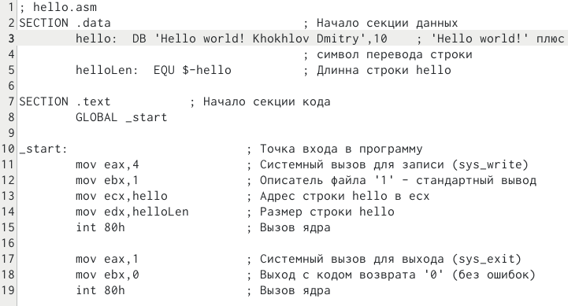{ #fig:013 width=70% }

Запускаю получившийся исполняемый файл (рис. [-@fig:014]).

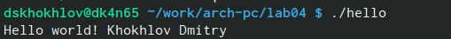{ #fig:014 width=70% }

Копирую файлы hello.asm и lab04.asm в свой локальный репозиторий и загружаю файлы на Github (рис. [-@fig:015]).

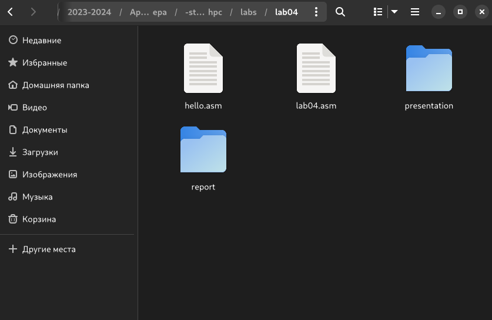{ #fig:015 width=70% }

# Выводы

Я освоил процедуры компиляции и сборки программ, написанных на ассемблере NASM.

# Список литературы{.unnumbered}

1. GDB: The GNU Project Debugger. — URL: https://www.gnu.org/software/gdb/.
2. GNU Bash Manual. — 2016. — URL: https://www.gnu.org/software/bash/manual/.
3. Midnight Commander Development Center. — 2021. — URL: https://midnight-commander.org/.
4. NASM Assembly Language Tutorials. — 2021. — URL: https://asmtutor.com/.
5. Newham C. Learning the bash Shell: Unix Shell Programming. — O’Reilly Media, 2005. — 354 с. — (In a Nutshell). — ISBN 0596009658. — URL: http://www.amazon.com/Learning-bash-Shell-Programming-Nutshell/dp/0596009658.
6. Robbins A. Bash Pocket Reference. — O’Reilly Media, 2016. — 156 с. — ISBN 978-1491941591.
7. The NASM documentation. — 2021. — URL: https://www.nasm.us/docs.php.
8. Zarrelli G. Mastering Bash. — Packt Publishing, 2017. — 502 с. — ISBN 9781784396879.
9. Колдаев В. Д., Лупин С. А. Архитектура ЭВМ. — М. : Форум, 2018.
10. Куляс О. Л., Никитин К. А. Курс программирования на ASSEMBLER. — М. : Солон-Пресс, 2017.
11. Новожилов О. П. Архитектура ЭВМ и систем. — М. : Юрайт, 2016.
12. Расширенный ассемблер: NASM. — 2021. — URL: https://www.opennet.ru/docs/RUS/nasm/.
13. Робачевский А., Немнюгин С., Стесик О. Операционная система UNIX. — 2-е изд. — БХВ Петербург, 2010. — 656 с. — ISBN 978-5-94157-538-1.
14. Столяров А. Программирование на языке ассемблера NASM для ОС Unix. — 2-е изд. — М. : МАКС Пресс, 2011. — URL: http://www.stolyarov.info/books/asm_unix.
15. Таненбаум Э. Архитектура компьютера. — 6-е изд. — СПб. : Питер, 2013. — 874 с. — (Классика Computer Science).
16. Таненбаум Э., Бос Х. Современные операционные системы. — 4-е изд. — СПб. : Питер,
2015. — 1120 с. — (Классика Computer Science).

