---
## Front matter
title: "Лабораторная работа №5"
subtitle: "Основы работы с Midnight Commander (mc). Структура программы на языке ассемблера NASM"
author: "Дмитрий Сергеевич Хохлов"

## Generic otions
lang: ru-RU
toc-title: "Содержание"

## Bibliography
bibliography: bib/cite.bib
csl: pandoc/csl/gost-r-7-0-5-2008-numeric.csl

## Pdf output format
toc: true # Table of contents
toc-depth: 2
lof: true # List of figures
lot: true # List of tables
fontsize: 12pt
linestretch: 1.5
papersize: a4
documentclass: scrreprt
## I18n polyglossia
polyglossia-lang:
  name: russian
  options:
	- spelling=modern
	- babelshorthands=true
polyglossia-otherlangs:
  name: english
## I18n babel
babel-lang: russian
babel-otherlangs: english
## Fonts
mainfont: PT Serif
romanfont: PT Serif
sansfont: PT Sans
monofont: PT Mono
mainfontoptions: Ligatures=TeX
romanfontoptions: Ligatures=TeX
sansfontoptions: Ligatures=TeX,Scale=MatchLowercase
monofontoptions: Scale=MatchLowercase,Scale=0.9
## Biblatex
biblatex: true
biblio-style: "gost-numeric"
biblatexoptions:
  - parentracker=true
  - backend=biber
  - hyperref=auto
  - language=auto
  - autolang=other*
  - citestyle=gost-numeric
## Pandoc-crossref LaTeX customization
figureTitle: "Рис."
tableTitle: "Таблица"
listingTitle: "Листинг"
lofTitle: "Список иллюстраций"
lotTitle: "Список таблиц"
lolTitle: "Листинги"
## Misc options
indent: true
header-includes:
  - \usepackage{indentfirst}
  - \usepackage{float} # keep figures where there are in the text
  - \floatplacement{figure}{H} # keep figures where there are in the text
---

# Цель работы

Целью работы является приобретение практических навыков работы в Midnight Commander. 
Освоение инструкций языка ассемблера mov и int.

# Выполнение лабораторной работы

Запустил Midnight Commander и перешёл в директорию ~/work/arch-pc.
Создал папку lab05 (рис. [-@fig:001])

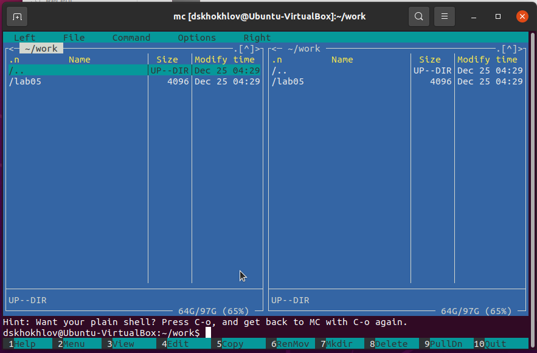{ #fig:001 width=70%, height=70% }

Создал файл с именем lab05-1.asm (рис. [-@fig:002])

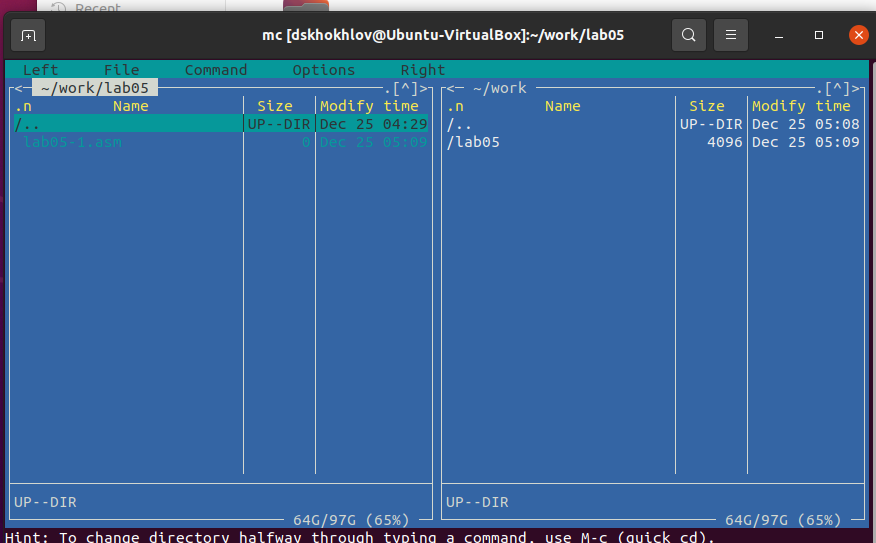{ #fig:002 width=70%, height=70% }

Отредактировал созданный файл, записав в него код. (рис. [-@fig:003])

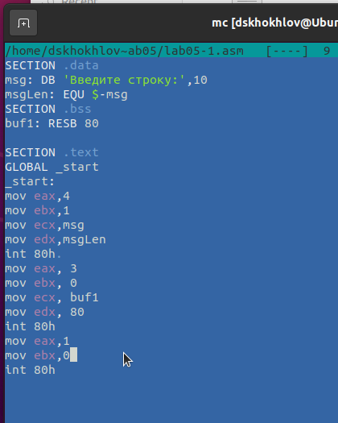{ #fig:003 width=70%, height=70% }

Открыл файл для проверки и удостоверился, что код записан верно. (рис. [-@fig:004])

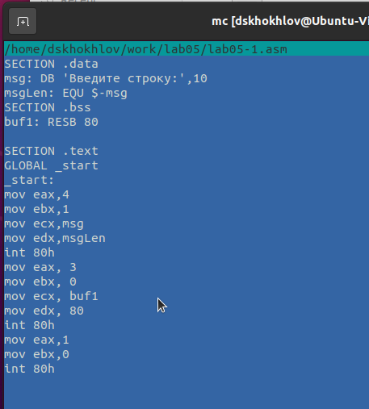{ #fig:004 width=70%, height=70% }

Сгенерировал исполняемый файл из программы и проверил его функциональность.(рис. [-@fig:005])

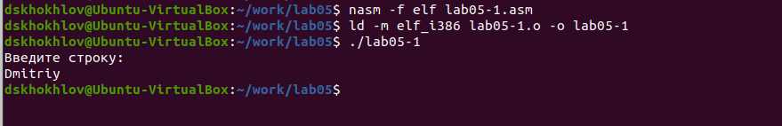{ #fig:005 width=70%, height=70% }

Загрузил файл in_out.asm и поместил его в рабочую директорию.
Создал копию файла lab05-1.asm под именем lab05-2.asm. (рис. [-@fig:006])

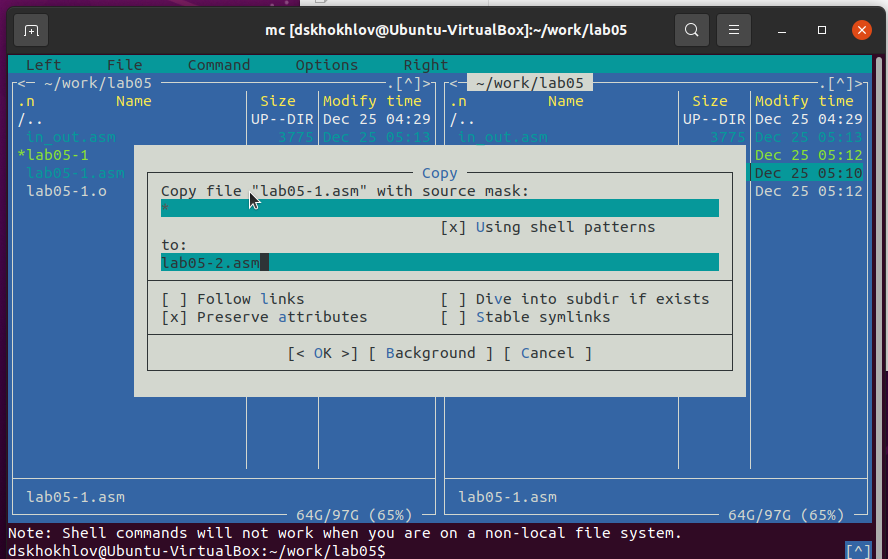{ #fig:006 width=70%, height=70% }

Написал код программы lab05-2.asm. (рис. [-@fig:007]) 
Скомпилировал и проверил выполнение программы. (рис. [-@fig:008])

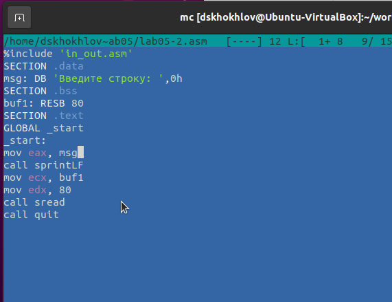{ #fig:007 width=70%, height=70% }

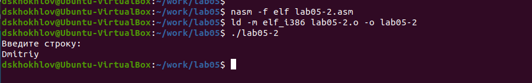{ #fig:008 width=70%, height=70% }

В файле lab5-2.asm произвёл замену подпрограммы sprintLF на sprint. (рис. [-@fig:009]). 
Собрал исполняемый файл заново. (рис. [-@fig:010]). 
Теперь выводимая строка не сопровождается символом перевода строки.

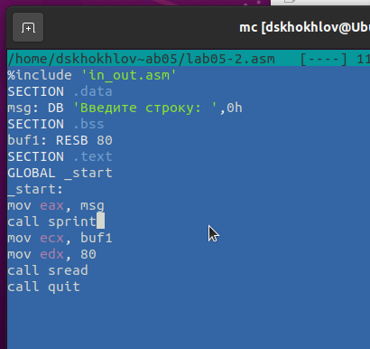{ #fig:009 width=70%, height=70% }

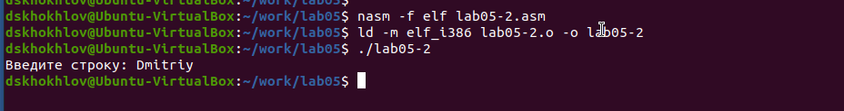{ #fig:010 width=70%, height=70% }

Скопировал содержимое файла lab05-1.asm и модифицировал его, чтобы программа выводила 
запрос вида "Введите строку:", затем принимала ввод с клавиатуры и отображала введённую 
строку (рис. [-@fig:011], рис. [-@fig:012])

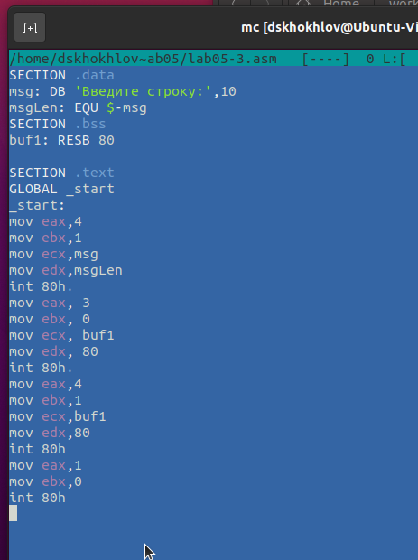{ #fig:011 width=70%, height=70% }

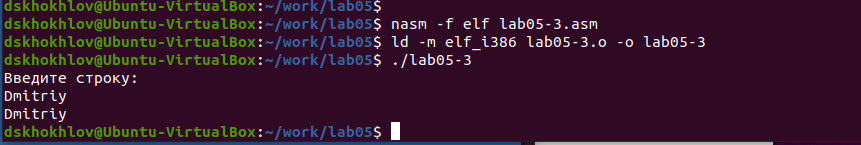{ #fig:012 width=70%, height=70% }

Аналогично, скопировал содержимое файла lab05-2.asm и адаптировал его так, 
чтобы программа запрашивала ввод строки с клавиатуры и отображала 
её на экране.(рис. [-@fig:013], рис. [-@fig:014])

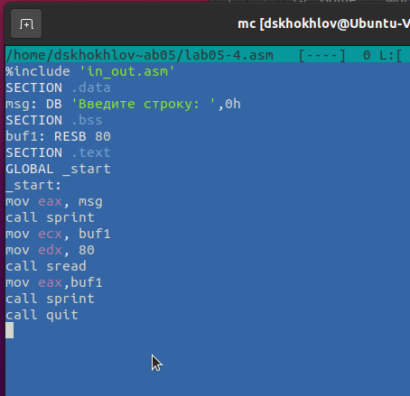{ #fig:013 width=70%, height=70% }

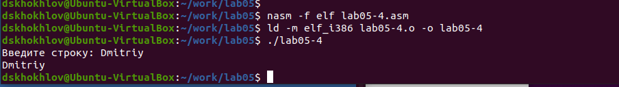{ #fig:014 width=70%, height=70% }

Различие между этими двумя реализациями заключается в использовании готовых 
подпрограмм для ввода/вывода, содержащихся в файле in_out.asm. Это позволяет 
просто распределить данные по регистрам и выполнить нужную подпрограмму с помощью команды call.

# Выводы

Научились писать базовые ассемблерные программы. Освоили ассемблерные инструкции mov и int.

# Список литературы{.unnumbered}

1. GDB: The GNU Project Debugger. — URL: https://www.gnu.org/software/gdb/.

2. GNU Bash Manual. — 2016. — URL: https://www.gnu.org/software/bash/manual/.

3. Midnight Commander Development Center. — 2021. — URL: https://midnight-commander.org/.

4. NASM Assembly Language Tutorials. — 2021. — URL: https://asmtutor.com/.

5. Newham C. Learning the bash Shell: Unix Shell Programming. — O’Reilly Media, 2005. — 354 с. — (In a Nutshell). — ISBN 0596009658. — URL: http://www.amazon.com/Learning-bash-Shell-Programming-Nutshell/dp/0596009658.

6. Robbins A. Bash Pocket Reference. — O’Reilly Media, 2016. — 156 с. — ISBN 978-1491941591.

7. The NASM documentation. — 2021. — URL: https://www.nasm.us/docs.php.

8. Zarrelli G. Mastering Bash. — Packt Publishing, 2017. — 502 с. — ISBN 9781784396879.

9. Колдаев В. Д., Лупин С. А. Архитектура ЭВМ. — М. : Форум, 2018.

10. Куляс О. Л., Никитин К. А. Курс программирования на ASSEMBLER. — М. : Солон-Пресс, 2017.

11. Новожилов О. П. Архитектура ЭВМ и систем. — М. : Юрайт, 2016.

12. Расширенный ассемблер: NASM. — 2021. — URL: https://www.opennet.ru/docs/RUS/nasm/.

13. Робачевский А., Немнюгин С., Стесик О. Операционная система UNIX. — 2-е изд. — БХВ Петербург, 2010. — 656 с. — ISBN 978-5-94157-538-1.

14. Столяров А. Программирование на языке ассемблера NASM для ОС Unix. — 2-е изд. — М. : МАКС Пресс, 2011. — URL: http://www.stolyarov.info/books/asm_unix.

15. Таненбаум Э. Архитектура компьютера. — 6-е изд. — СПб. : Питер, 2013. — 874 с. — (Классика Computer Science).

16. Таненбаум Э., Бос Х. Современные операционные системы. — 4-е изд. — СПб. : Питер, 2015. — 1120 с. — (Классика Computer Science).