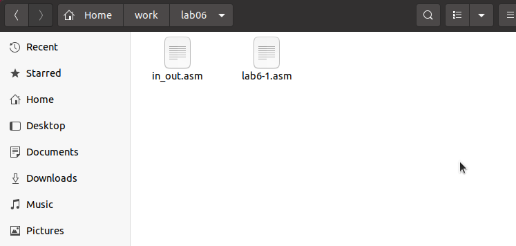

---
## Front matter
title: "Лабораторная работа №6"
subtitle: "Арифметические операции в NASM."
author: "Дмитрий Сергеевич Хохлов"

## Generic otions
lang: ru-RU
toc-title: "Содержание"

## Bibliography
bibliography: bib/cite.bib
csl: pandoc/csl/gost-r-7-0-5-2008-numeric.csl

## Pdf output format
toc: true # Table of contents
toc-depth: 2
lof: true # List of figures
lot: true # List of tables
fontsize: 12pt
linestretch: 1.5
papersize: a4
documentclass: scrreprt
## I18n polyglossia
polyglossia-lang:
  name: russian
  options:
	- spelling=modern
	- babelshorthands=true
polyglossia-otherlangs:
  name: english
## I18n babel
babel-lang: russian
babel-otherlangs: english
## Fonts
mainfont: PT Serif
romanfont: PT Serif
sansfont: PT Sans
monofont: PT Mono
mainfontoptions: Ligatures=TeX
romanfontoptions: Ligatures=TeX
sansfontoptions: Ligatures=TeX,Scale=MatchLowercase
monofontoptions: Scale=MatchLowercase,Scale=0.9
## Biblatex
biblatex: true
biblio-style: "gost-numeric"
biblatexoptions:
  - parentracker=true
  - backend=biber
  - hyperref=auto
  - language=auto
  - autolang=other*
  - citestyle=gost-numeric
## Pandoc-crossref LaTeX customization
figureTitle: "Рис."
tableTitle: "Таблица"
listingTitle: "Листинг"
lofTitle: "Список иллюстраций"
lotTitle: "Список таблиц"
lolTitle: "Листинги"
## Misc options
indent: true
header-includes:
  - \usepackage{indentfirst}
  - \usepackage{float} # keep figures where there are in the text
  - \floatplacement{figure}{H} # keep figures where there are in the text
---

# Цель работы

Целью работы является освоение арифметических инструкций языка ассемблера NASM.

# Выполнение лабораторной работы

Сформировал директорию для выполнения заданий лабораторной работы №6, перешел в созданную папку 
и создал файла lab6-1.asm. (рис. [-@fig:001])

{ #fig:001 width=70%, height=70% }

Давайте рассмотрим примеры программ, которые демонстрируют вывод символов и числовых данных. Эти программы будут отображать данные, помещенные в регистр eax.

{ #fig:002 width=70%, height=70% }

В этом примере программы (см. рисунок [-@fig:002]) мы помещаем символ '6' в регистр eax с помощью команды (mov eax, '6'), а символ '4' в регистр ebx (mov ebx, '4').
Далее выполняем сложение значений, содержащихся в регистрах eax и ebx, с помощью команды (add eax, ebx), где результат сложения сохраняется в регистре eax.
Затем производим вывод полученного результата.
Однако для того чтобы функция sprintLF сработала корректно, нужно, чтобы в регистре eax находился адрес. По этой причине мы используем вспомогательную переменную.
Значение из регистра eax переносим в переменную buf1 (mov [buf1], eax),
затем загружаем адрес переменной buf1 обратно в регистр eax (mov eax, buf1) и выполняем вызов функции sprintLF.

{ #fig:003 width=70%, height=70% }

В результате, когда мы ожидаем увидеть число 10 на выводе из регистра eax, на деле получим символ 'j'.
Это объясняется тем, что символу '6' соответствует двоичный код 00110110 (или 54 в десятичной системе),
а символу '4' - двоичный код 00110100 (или 52 в десятичной системе).
После выполнения операции сложения add eax, ebx, мы получаем сумму кодов - 01101010 (или 106 в десятичной системе),
что соответствует символу 'j'. (см. рисунок [-@fig:003])

Затем произвожу корректировку текста программы, заменив символьные значения на числовые в регистрах.  (рис. [-@fig:004])

{ #fig:004 width=70%, height=70% }

{ #fig:005 width=70%, height=70% }

Так же, как и в прошлый раз, в результате выполнения программы число 10 не будет выведено. 
Взамен этого на экране появится символ с кодом 10, который является символом новой строки 
(перевод строки). Смотрите (рис. [-@fig:005]).
Этот символ не виден в окне консоли, но он создаёт пустую строку после вывода.

Как было указано ранее, в файле in_out.asm содержатся специальные подпрограммы для того, чтобы преобразовывать символы ASCII в числовые значения и наоборот. 
Я внес изменения в текст программы, чтобы использовать эти подпрограммы.

{ #fig:006 width=70%, height=70% }

{ #fig:007 width=70%, height=70% }

По завершении работы программы на экран будет выведено число 106. (рис. [-@fig:007])
В этом примере, так же как и в первом, инструкция add суммирует коды символов 
'6' и '4' (54+52=106). Но в этот раз, в отличие от предыдущего случая, благодаря функции 
iprintLF, выводится само число, а не символ с соответствующим числовым кодом.

В соответствии с предыдущим примером, мы заменим символы на числа. (рис. [-@fig:008])

{ #fig:008 width=70%, height=70% }

Функция iprintLF теперь выводит число, так как в качестве операндов использовались числа, а не их символьные коды.
В итоге на экране появляется число 10. (рис. [-@fig:009])

{ #fig:009 width=70%, height=70% }

Произвел замену функции iprintLF на iprint. Скомпилировал и запустил скомпилированный файл. 
Основное отличие в результате – отсутствие новой строки в конце вывода. (см. рисунок [-@fig:010])

{ #fig:010 width=70%, height=70% }

Для демонстрации выполнения арифметических операций в NASM, рассмотрим программу, 
которая вычисляет следующее арифметическое выражение: (см. рисунки [-@fig:011] и [-@fig:012])
$$f(x) = (5 * 2 + 3)/3$$.

{ #fig:011 width=70%, height=70% }

{ #fig:012 width=70%, height=70% }

Модифицировал код программы для расчета нового выражения:
$$f(x) = (4 * 6 + 2)/5$$. 
Собрал исполняемый файл и провел его тестирование. (см. рисунки [-@fig:013] и [-@fig:014])

{ #fig:013 width=70%, height=70% }

{ #fig:014 width=70%, height=70% }

В качестве еще одного примера возьмем программу, которая вычисляет вариант задания на 
основе номера студенческого билета. (см. рисунки [-@fig:015] и [-@fig:016])

В этом случае число для арифметических операций вводится пользователем через клавиатуру. 
Как было указано ранее, ввод происходит в символьной форме, и для правильного выполнения 
арифметических операций в NASM эти символы необходимо преобразовать в числовой формат. 
Для этого можно использовать функцию atoi, которая содержится в файле in_out.asm.

{ #fig:015 width=70%, height=70% }

{ #fig:016 width=70%, height=70% }

## Ответы на вопросы по программе variant.asm

1. Какие строки листинга отвечают за вывод на экран сообщения ‘Ваш вариант:’?

Команда "mov eax, rem" загружает в регистр значение, соответствующее строке "Ваш вариант:"

Команда "call sprint" инициирует процедуру, которая выводит строку на экран

2. Для чего используются следующие инструкции?

Команда "mov ecx, x" копирует в регистр ecx значение из переменной x

Команда "mov edx, 80" заносит число 80 в регистр edx

Команда "call sread" активирует процедуру, которая читает вводимые данные, например номер студенческого билета, с консоли

3. Для чего используется инструкция "call atoi"?

Команда "call atoi" служит для конвертации введенного текста в целочисленное значение

4. Какие строки листинга отвечают за вычисления варианта?

Команда "xor edx, edx" очищает содержимое регистра edx

Команда "mov ebx, 20" помещает число 20 в регистр ebx

Команда "div ebx" осуществляет деление числа, находящегося в аккумуляторе, на содержимое регистра ebx

Команда "inc edx" увеличивает на единицу значение в регистре edx

5. В какой регистр записывается остаток от деления при выполнении инструкции "div ebx"?

Регистр edx получает остаток от операции деления

6. Для чего используется инструкция "inc edx"?

Команда "inc edx" прибавляет единицу к содержимому регистра edx, что необходимо для корректного расчета варианта

7. Какие строки листинга отвечают за вывод на экран результата вычислений?

Команда "mov eax, edx" переносит результат вычислений в регистр eax

Команда "call iprintLF" запускает процедуру, которая выводит результат на экран с новой строки

## Самостоятельное задание

Написать программу вычисления выражения y = f(x). Программа должна выводить выражение 
для вычисления, выводить запрос на ввод значения x, 
вычислять заданное выражение в зависимости от введенного x, выводить результат вычислений. 
Вид функции f(x) выбрать из таблицы 6.3 вариантов заданий в соответствии с номером 
полученным при выполнении лабораторной работы. 
Создайте исполняемый файл и проверьте его работу для значений x1 и x2 из 6.3.

Получили вариант 14 - $$(x/2 + 8)*3$$  для $$x_{1}=1, x_{2}=4$$ (рис. [-@fig:017]) (рис. [-@fig:018])

{ #fig:017 width=70%, height=70% }

{ #fig:018 width=70%, height=70% }

# Выводы

Изучили работу с арифметическими операциями.

# Список литературы{.unnumbered}

1. GDB: The GNU Project Debugger. — URL: https://www.gnu.org/software/gdb/.

2. GNU Bash Manual. — 2016. — URL: https://www.gnu.org/software/bash/manual/.

3. Midnight Commander Development Center. — 2021. — URL: https://midnight-commander.org/.

4. NASM Assembly Language Tutorials. — 2021. — URL: https://asmtutor.com/.

5. Newham C. Learning the bash Shell: Unix Shell Programming. — O’Reilly Media, 2005. — 354 с. — (In a Nutshell). — ISBN 0596009658. — URL: http://www.amazon.com/Learning-bash-Shell-Programming-Nutshell/dp/0596009658.

6. Robbins A. Bash Pocket Reference. — O’Reilly Media, 2016. — 156 с. — ISBN 978-1491941591.

7. The NASM documentation. — 2021. — URL: https://www.nasm.us/docs.php.

8. Zarrelli G. Mastering Bash. — Packt Publishing, 2017. — 502 с. — ISBN 9781784396879.

9. Колдаев В. Д., Лупин С. А. Архитектура ЭВМ. — М. : Форум, 2018.

10. Куляс О. Л., Никитин К. А. Курс программирования на ASSEMBLER. — М. : Солон-Пресс, 2017.

11. Новожилов О. П. Архитектура ЭВМ и систем. — М. : Юрайт, 2016.

12. Расширенный ассемблер: NASM. — 2021. — URL: https://www.opennet.ru/docs/RUS/nasm/.

13. Робачевский А., Немнюгин С., Стесик О. Операционная система UNIX. — 2-е изд. — БХВ Петербург, 2010. — 656 с. — ISBN 978-5-94157-538-1.

14. Столяров А. Программирование на языке ассемблера NASM для ОС Unix. — 2-е изд. — М. : МАКС Пресс, 2011. — URL: http://www.stolyarov.info/books/asm_unix.

15. Таненбаум Э. Архитектура компьютера. — 6-е изд. — СПб. : Питер, 2013. — 874 с. — (Классика Computer Science).

16. Таненбаум Э., Бос Х. Современные операционные системы. — 4-е изд. — СПб. : Питер, 2015. — 1120 с. — (Классика Computer Science).