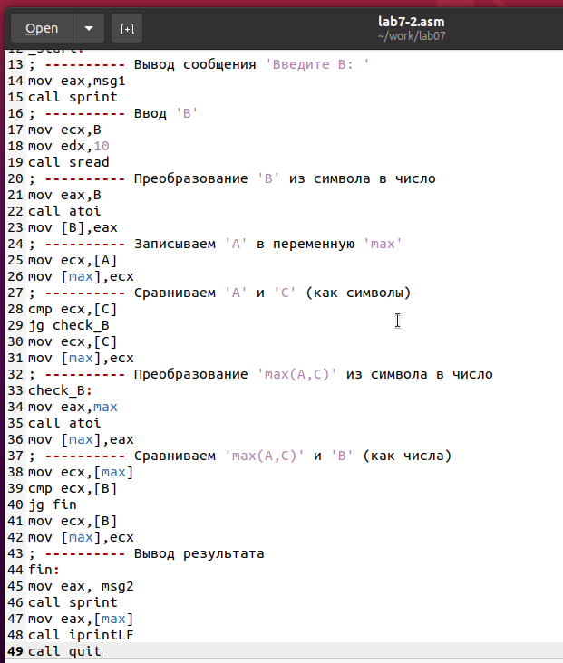

---
## Front matter
title: "Лабораторная работа №7"
subtitle: "Команды безусловного и условного переходов в Nasm. Программирование ветвлений"
author: "Дмитрий Сергеевич Хохлов"

## Generic otions
lang: ru-RU
toc-title: "Содержание"

## Bibliography
bibliography: bib/cite.bib
csl: pandoc/csl/gost-r-7-0-5-2008-numeric.csl

## Pdf output format
toc: true # Table of contents
toc-depth: 2
lof: true # List of figures
lot: true # List of tables
fontsize: 12pt
linestretch: 1.5
papersize: a4
documentclass: scrreprt
## I18n polyglossia
polyglossia-lang:
  name: russian
  options:
	- spelling=modern
	- babelshorthands=true
polyglossia-otherlangs:
  name: english
## I18n babel
babel-lang: russian
babel-otherlangs: english
## Fonts
mainfont: PT Serif
romanfont: PT Serif
sansfont: PT Sans
monofont: PT Mono
mainfontoptions: Ligatures=TeX
romanfontoptions: Ligatures=TeX
sansfontoptions: Ligatures=TeX,Scale=MatchLowercase
monofontoptions: Scale=MatchLowercase,Scale=0.9
## Biblatex
biblatex: true
biblio-style: "gost-numeric"
biblatexoptions:
  - parentracker=true
  - backend=biber
  - hyperref=auto
  - language=auto
  - autolang=other*
  - citestyle=gost-numeric
## Pandoc-crossref LaTeX customization
figureTitle: "Рис."
tableTitle: "Таблица"
listingTitle: "Листинг"
lofTitle: "Список иллюстраций"
lotTitle: "Список таблиц"
lolTitle: "Листинги"
## Misc options
indent: true
header-includes:
  - \usepackage{indentfirst}
  - \usepackage{float} # keep figures where there are in the text
  - \floatplacement{figure}{H} # keep figures where there are in the text
---

# Цель работы

Целью работы является изучение команд условного и безусловного переходов. Приобретение навыков написания программ с использованием переходов. Знакомство с назначением и структурой файла листинга.

# Выполнение лабораторной работы

Сформировал директорию для хранения программ лабораторного занятия № 7 и создал файл с 
исходным кодом lab7-1.asm. (см. рисунок [-@fig:001])

{ #fig:001 width=70%, height=70% }

Команда jmp в ассемблере NASM применяется для осуществления прямых переходов. 
Приведем пример кода, демонстрирующего применение команды jmp. Внес текст примера в 
файл lab7-1.asm, оформленный как листинг 7.1. (см. рисунок [-@fig:002])

{ #fig:002 width=70%, height=70% }

Скомпилировал исполняемый файл и выполнил его. (см. рисунок [-@fig:003])

{ #fig:003 width=70%, height=70% }

Команда jmp дает возможность выполнить переход как вперед, так и назад в коде. 
Модифицируем код так, чтобы он сначала вывел 'Сообщение № 2', затем 'Сообщение № 1' 
и после этого завершил выполнение. Для этого после вывода 'Сообщение № 2' вставим команду 
jmp с меткой _label1 (то есть осуществим переход к коду, выводящему 'Сообщение № 1'), а 
после 'Сообщение № 1' вставим команду jmp с меткой _end (то есть перейдем к команде call quit).

Внес изменения в исходный код программы, следуя листингу 7.2. (см. рисунок [-@fig:004]) (см. рисунок [-@fig:005])

{ #fig:004 width=70%, height=70% }

{ #fig:005 width=70%, height=70% }


Отредактировал исходный код программы, изменив команды jmp для получения следующего результата выполнения (см. рисунок [-@fig:006]) (см. рисунок [-@fig:007])
```
Сообщение № 3
Сообщение № 2
Сообщение № 1
```

{ #fig:006 width=70%, height=70% }

{ #fig:007 width=70%, height=70% }

Использование инструкции jmp приводит к переходу в любом случае. 
Однако, часто при написании программ необходимо использовать условные переходы, 
т.е. переход должен происходить если выполнено какое-либо условие. 
В качестве примера рассмотрим программу, которая определяет и выводит на экран наибольшую из 3 целочисленных переменных: A,B и C. 
Значения для A и C задаются в программе, значение B вводиться с клавиатуры. 

Скомпилировал исполняемый файл и провел тестирование его функционирования с различными значениями переменной B (см. рисунок [-@fig:008]) (см. рисунок [-@fig:009]).

{ #fig:008 width=70%, height=70% }

{ #fig:009 width=70%, height=70% }

Обычно при ассемблировании nasm создает только объектный файл. Однако можно сгенерировать файл листинга, используя ключ -l и указав имя файла листинга в командной строке.

Сгенерировал файл листинга для кода из файла lab7-2.asm (см. рисунок [-@fig:010])

{ #fig:010 width=70%, height=70% }

строка 189

- 14 - номер строки в подпрограмме

- 000000E8 - адрес

- B8[00000000]  - машинный код

- mov eax,msg1 - код программы - перекладывает msg1 в eax 

строка 190

- 15 - номер строки в подпрограмме

- 000000ED - адрес

- E81DFFFFFF - машинный код

- call sprint - код программы - вызов подпрограммы печати

строка 192

- 17 - номер строки в подпрограмме

- 000000F2 - адрес

- B9[0A000000] - машинный код

- mov ecx,B - код программы - перекладывает B в eax 

Открыл файл lab7-2.asm с исходным кодом и удалил один из операндов в инструкции 
с двумя операндами. Затем осуществил ассемблирование с созданием файла листинга. (см. рисунок [-@fig:011]) (см. рисунок [-@fig:012])

{ #fig:011 width=70%, height=70% }

{ #fig:012 width=70%, height=70% }

Объектный файл не был сгенерирован из-за наличия ошибки в коде. Тем не менее, был получен листинг, в котором указана ошибка.

## Самостоятельное задание

Напишите программу нахождения наименьшей из 3 целочисленных переменных a,b и c. 
Значения переменных выбрать из табл. 7.5 в соответствии с вариантом, полученным при выполнении лабораторной работы № 6.
Создайте исполняемый файл и проверьте его работу (рис. [-@fig:013]) (рис. [-@fig:014])

для варианта 14 - 81,22,72

{ #fig:013 width=70%, height=70% }

{ #fig:014 width=70%, height=70% }

Напишите программу, которая для введенных с клавиатуры значений x и a вычисляет значение заданной функции f(x) и выводит результат вычислений. 
Вид функции f(x) выбрать из таблицы 7.6 вариантов заданий в соответствии с вариантом, полученным при выполнении лабораторной работы № 7. 
Создайте исполняемый файл и проверьте его работу для значений X и a из 7.6. (рис. [-@fig:015]) (рис. [-@fig:016])

для варианта 14

$$
 \begin{cases}
	3a+1, x < a
	\\   
	3x + 1, x \ge a
 \end{cases}
$$

Если подставить $x=2, a=3$ получается $10$.

Если подставить $x=4, a=2$ получается $13$.

{ #fig:015 width=70%, height=70% }

{ #fig:016 width=70%, height=70% }

# Выводы

Изучили команды условного и безусловного переходов, познакомились с фалом листинга.

# Список литературы{.unnumbered}

1. GDB: The GNU Project Debugger. — URL: https://www.gnu.org/software/gdb/.

2. GNU Bash Manual. — 2016. — URL: https://www.gnu.org/software/bash/manual/.

3. Midnight Commander Development Center. — 2021. — URL: https://midnight-commander.org/.

4. NASM Assembly Language Tutorials. — 2021. — URL: https://asmtutor.com/.

5. Newham C. Learning the bash Shell: Unix Shell Programming. — O’Reilly Media, 2005. — 354 с. — (In a Nutshell). — ISBN 0596009658. — URL: http://www.amazon.com/Learning-bash-Shell-Programming-Nutshell/dp/0596009658.

6. Robbins A. Bash Pocket Reference. — O’Reilly Media, 2016. — 156 с. — ISBN 978-1491941591.

7. The NASM documentation. — 2021. — URL: https://www.nasm.us/docs.php.

8. Zarrelli G. Mastering Bash. — Packt Publishing, 2017. — 502 с. — ISBN 9781784396879.

9. Колдаев В. Д., Лупин С. А. Архитектура ЭВМ. — М. : Форум, 2018.

10. Куляс О. Л., Никитин К. А. Курс программирования на ASSEMBLER. — М. : Солон-Пресс, 2017.

11. Новожилов О. П. Архитектура ЭВМ и систем. — М. : Юрайт, 2016.

12. Расширенный ассемблер: NASM. — 2021. — URL: https://www.opennet.ru/docs/RUS/nasm/.

13. Робачевский А., Немнюгин С., Стесик О. Операционная система UNIX. — 2-е изд. — БХВ Петербург, 2010. — 656 с. — ISBN 978-5-94157-538-1.

14. Столяров А. Программирование на языке ассемблера NASM для ОС Unix. — 2-е изд. — М. : МАКС Пресс, 2011. — URL: http://www.stolyarov.info/books/asm_unix.

15. Таненбаум Э. Архитектура компьютера. — 6-е изд. — СПб. : Питер, 2013. — 874 с. — (Классика Computer Science).

16. Таненбаум Э., Бос Х. Современные операционные системы. — 4-е изд. — СПб. : Питер, 2015. — 1120 с. — (Классика Computer Science).