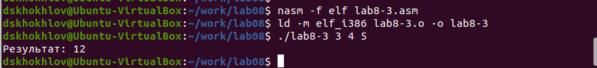

---
## Front matter
title: "Лабораторная работа №8"
subtitle: "Программирование цикла. Обработка аргументов командной строки."
author: "Дмитрий Сергеевич Хохлов"

## Generic otions
lang: ru-RU
toc-title: "Содержание"

## Bibliography
bibliography: bib/cite.bib
csl: pandoc/csl/gost-r-7-0-5-2008-numeric.csl

## Pdf output format
toc: true # Table of contents
toc-depth: 2
lof: true # List of figures
lot: true # List of tables
fontsize: 12pt
linestretch: 1.5
papersize: a4
documentclass: scrreprt
## I18n polyglossia
polyglossia-lang:
  name: russian
  options:
	- spelling=modern
	- babelshorthands=true
polyglossia-otherlangs:
  name: english
## I18n babel
babel-lang: russian
babel-otherlangs: english
## Fonts
mainfont: PT Serif
romanfont: PT Serif
sansfont: PT Sans
monofont: PT Mono
mainfontoptions: Ligatures=TeX
romanfontoptions: Ligatures=TeX
sansfontoptions: Ligatures=TeX,Scale=MatchLowercase
monofontoptions: Scale=MatchLowercase,Scale=0.9
## Biblatex
biblatex: true
biblio-style: "gost-numeric"
biblatexoptions:
  - parentracker=trueЗырянов Артём Алексеевич	НБИбд-01-22

  - backend=biber
  - hyperref=auto
  - language=auto
  - autolang=other*
  - citestyle=gost-numeric
## Pandoc-crossref LaTeX customization
figureTitle: "Рис."
tableTitle: "Таблица"
listingTitle: "Листинг"
lofTitle: "Список иллюстраций"
lotTitle: "Список таблиц"
lolTitle: "Листинги"
## Misc options
indent: true
header-includes:
  - \usepackage{indentfirst}
  - \usepackage{float} # keep figures where there are in the text
  - \floatplacement{figure}{H} # keep figures where there are in the text
---

# Цель работы

Целью работы является приобретение навыков написания программ с использованием циклов и обработкой аргументов командной строки..

# Выполнение лабораторной работы

Сформировал директорию для программ, связанных с лабораторной № 8, и создал исходный файл 
с именем lab8-1.asm.

При использовании циклов в ассемблере NASM и применении команды loop следует учитывать, 
что она автоматически декрементирует счетчик, находящийся в регистре ecx. Возьмем для примера 
программу, демонстрирующую вывод текущего значения регистра ecx.
 
В файл lab8-1.asm внес код из примера под номером 8.1, представленного на иллюстрации [-@fig:001].
Скомпилировал программу, получил исполняемый файл и осуществил его тестирование, 
результаты которого отражены на рисунке [-@fig:002].

{ #fig:001 width=70%, height=70% }

{ #fig:002 width=70%, height=70% }

Приведенный пример иллюстрирует, что манипуляции с регистром ecx внутри цикла loop 
могут привести к ошибкам в работе программы. Внес корректировки в код программы, 
добавив действия по изменению значения регистра ecx в процессе итераций, 
как показано на рисунке [-@fig:003].

Программа инициирует бесконечный цикл, если N имеет нечетное значение, 
и выводит исключительно нечетные числа, если N четное, как видно на рисунке [-@fig:004].

{ #fig:003 width=70%, height=70% }

{ #fig:004 width=70%, height=70% }

Для корректного использования регистра ecx в цикле и избегания ошибок можно 
применять стек. Произвел модификацию программного кода, добавив инструкции push и pop 
для сохранения и восстановления счетчика цикла, что отображено на рисунке [-@fig:005].

Скомпилировал исполняемый файл и провел его тестирование. Программа последовательно 
выводит числа от N-1 до 0, с количеством итераций, равным N, что подтверждается изображением [-@fig:006].

{ #fig:005 width=70%, height=70% }

{ #fig:006 width=70%, height=70% }

Сформировал файл lab8-2.asm в директории ~/work/arch-pc/lab08 и занес в него код из примера 8.2, как показано на иллюстрации [-@fig:007].

Скомпилировал и выполнил скомпилированный файл, предоставив ему в качестве параметров 
несколько аргументов. В результате, программа успешно обработала пять аргументов, 
которые определяются как отдельные слова или числа, разделенные пробелами, 
(рис. [-@fig:008]).

{ #fig:007 width=70%, height=70% }

{ #fig:008 width=70%, height=70% }

Теперь давайте обратим внимание на другой пример программы, которая демонстрирует 
расчет суммы чисел, передаваемых в нее в виде аргументов командной строки, что 
визуализировано на рисунках [-@fig:009] и [-@fig:010].

{ #fig:009 width=70%, height=70% }

{ #fig:010 width=70%, height=70% }

Модифицировал код из примера 8.3 так, чтобы программа теперь выполняла вычисление произведения значений, переданных в 
командной строке, что отражено на иллюстрациях [-@fig:011] и [-@fig:012].

{ #fig:011 width=70%, height=70% }

{ #fig:012 width=70%, height=70% }

## Самостоятельное задание

Напишите программу, которая находит сумму значений функции 
$f(x)$ для $x = x_1, x_2, ..., x_n$, т.е. программа должна выводить значение 
$f(x_1) + f(x_2)+ ... +f(x_n)$. 
Значения $x$ передаются как аргументы. 
Вид функции $f(x)$ выбрать из таблицы 8.1 вариантов заданий в соответствии с вариантом, 
полученным при выполнении лабораторной работы № 7. 
Создайте исполняемый файл и проверьте его работу на нескольких наборах $x$.(рис. [-@fig:013]) (рис. [-@fig:014])

для варианта 14 $$f(x) = 7(x+1) $$ 

{ #fig:013 width=70%, height=70% }

Для проверки я запустил сначала с одним аргументом. Так, при подстановке $f(1)=14, f(2)=21$

Затем подал несколько аргументов и получил сумму значений функции.

{ #fig:014 width=70%, height=70% }

# Выводы

Освоили работы со стеком, циклом и аргументами на ассемблере nasm.

# Список литературы{.unnumbered}

1. GDB: The GNU Project Debugger. — URL: https://www.gnu.org/software/gdb/.

2. GNU Bash Manual. — 2016. — URL: https://www.gnu.org/software/bash/manual/.

3. Midnight Commander Development Center. — 2021. — URL: https://midnight-commander.org/.

4. NASM Assembly Language Tutorials. — 2021. — URL: https://asmtutor.com/.

5. Newham C. Learning the bash Shell: Unix Shell Programming. — O’Reilly Media, 2005. — 354 с. — (In a Nutshell). — ISBN 0596009658. — URL: http://www.amazon.com/Learning-bash-Shell-Programming-Nutshell/dp/0596009658.

6. Robbins A. Bash Pocket Reference. — O’Reilly Media, 2016. — 156 с. — ISBN 978-1491941591.

7. The NASM documentation. — 2021. — URL: https://www.nasm.us/docs.php.

8. Zarrelli G. Mastering Bash. — Packt Publishing, 2017. — 502 с. — ISBN 9781784396879.

9. Колдаев В. Д., Лупин С. А. Архитектура ЭВМ. — М. : Форум, 2018.

10. Куляс О. Л., Никитин К. А. Курс программирования на ASSEMBLER. — М. : Солон-Пресс, 2017.

11. Новожилов О. П. Архитектура ЭВМ и систем. — М. : Юрайт, 2016.

12. Расширенный ассемблер: NASM. — 2021. — URL: https://www.opennet.ru/docs/RUS/nasm/.

13. Робачевский А., Немнюгин С., Стесик О. Операционная система UNIX. — 2-е изд. — БХВ Петербург, 2010. — 656 с. — ISBN 978-5-94157-538-1.

14. Столяров А. Программирование на языке ассемблера NASM для ОС Unix. — 2-е изд. — М. : МАКС Пресс, 2011. — URL: http://www.stolyarov.info/books/asm_unix.

15. Таненбаум Э. Архитектура компьютера. — 6-е изд. — СПб. : Питер, 2013. — 874 с. — (Классика Computer Science).

16. Таненбаум Э., Бос Х. Современные операционные системы. — 4-е изд. — СПб. : Питер, 2015. — 1120 с. — (Классика Computer Science).