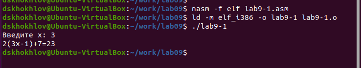
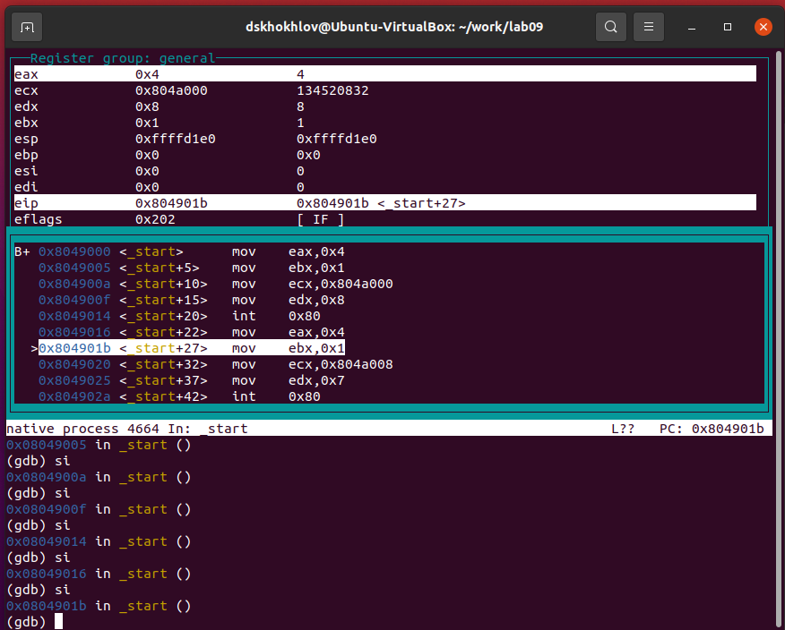

---
## Front matter
title: "Лабораторная работа №9"
subtitle: "Понятие подпрограммы. Отладчик GDB."
author: "Дмитрий Сергеевич Хохлов"

## Generic otions
lang: ru-RU
toc-title: "Содержание"

## Bibliography
bibliography: bib/cite.bib
csl: pandoc/csl/gost-r-7-0-5-2008-numeric.csl

## Pdf output format
toc: true # Table of contents
toc-depth: 2
lof: true # List of figures
lot: true # List of tables
fontsize: 12pt
linestretch: 1.5
papersize: a4
documentclass: scrreprt
## I18n polyglossia
polyglossia-lang:
  name: russian
  options:
	- spelling=modern
	- babelshorthands=true
polyglossia-otherlangs:
  name: english
## I18n babel
babel-lang: russian
babel-otherlangs: english
## Fonts
mainfont: PT Serif
romanfont: PT Serif
sansfont: PT Sans
monofont: PT Mono
mainfontoptions: Ligatures=TeX
romanfontoptions: Ligatures=TeX
sansfontoptions: Ligatures=TeX,Scale=MatchLowercase
monofontoptions: Scale=MatchLowercase,Scale=0.9
## Biblatex
biblatex: true
biblio-style: "gost-numeric"
biblatexoptions:
  - parentracker=true
  - backend=biber
  - hyperref=auto
  - language=auto
  - autolang=other*
  - citestyle=gost-numeric
## Pandoc-crossref LaTeX customization
figureTitle: "Рис."
tableTitle: "Таблица"
listingTitle: "Листинг"
lofTitle: "Список иллюстраций"
lotTitle: "Список таблиц"
lolTitle: "Листинги"
## Misc options
indent: true
header-includes:
  - \usepackage{indentfirst}
  - \usepackage{float} # keep figures where there are in the text
  - \floatplacement{figure}{H} # keep figures where there are in the text
---

# Цель работы

Целью работы является приобретение навыков написания программ с использованием подпрограмм.
Знакомство с методами отладки при помощи GDB и его основными возможностями.

# Выполнение лабораторной работы

Я организовал рабочую директорию для лабораторного задания № 9 и переместился в нее.
После этого произвел создание файла lab9-1.asm.

Давайте рассмотрим пример программы, которая вычисляет арифметическое выражение 
$f(x) = 2x+7$ с использованием вспомогательной функции calcul. В этом случае $x$ 
получаем из пользовательского ввода, а расчет выражения осуществляется внутри 
вспомогательной функции. (см. рис. [-@fig:001]) (см. рис. [-@fig:002])

{ #fig:001 width=70%, height=70% }

{ #fig:002 width=70%, height=70% }

Произвел модификацию кода программы, включив дополнительную подпрограмму subcalcul в 
уже существующую подпрограмму calcul для реализации расчета составного выражения 
$f(g(x))$, где $x$ также получаем через ввод пользователя и 
$f(x) = 2x + 7, g(x) = 3x − 1$. (см. рис. [-@fig:003]) (см. рис. [-@fig:004])

{ #fig:003 width=70%, height=70% }

{ #fig:004 width=70%, height=70% }

Сформировал файл lab9-2.asm, содержащий исходный код программы из Приложения 9.2. 
(Эта программа осуществляет вывод на экран фразы Hello world!). (см. рис. [-@fig:005])

{ #fig:005 width=70%, height=70% }

Скомпилировал исполняемый файл, добавив отладочную информацию с использованием ключа '-g' для последующей работы в отладчике GDB.

Загрузил полученный исполняемый файл в отладчик GDB и осуществил проверку функционирования программы, инициировав ее выполнение командой 'run' (или 'r' в сокращенной форме). (см. рис. [-@fig:006])

{ #fig:006 width=70%, height=70% }

Для детального изучения программы установил точку останова на метке 'start', которая является начальной точкой выполнения любой программы на ассемблере, и выполнил запуск. После этого изучил дизассемблированный код программы. (см. рис. [-@fig:007]) (см. рис. [-@fig:008])

{ #fig:007 width=70%, height=70% }

{ #fig:008 width=70%, height=70% }

Чтобы проверить установленные точки остановки, в частности для метки '_start', я использовал команду 'info breakpoints' или в сокращении 'i b'. После этого задал новую точку остановки, нацелив ее на адрес, где располагается инструкция перед последней, а именно 'mov ebx, 0x0'. (см. рисунок [-@fig:009])

{ #fig:009 width=70%, height=70% }

В среде отладки GDB предусмотрена возможность просмотра и редактирования содержимого памяти и регистров. Я выполнил пять шагов инструкций с использованием команды 'stepi', сокращенно 'si', и наблюдал за изменениями в регистрах. (см. рисунок [-@fig:010]) (см. рисунок [-@fig:011])

{ #fig:010 width=70%, height=70% }

{ #fig:011 width=70%, height=70% }

Для модификации значений в регистрах или ячейках памяти применял команду 'set', указывая в аргументах название регистра или адрес. Таким образом, я изменил первый символ в переменной msg1. (см. рисунок [-@fig:012])

{ #fig:012 width=70%, height=70% }

Используя ту же команду 'set', я внес изменения в первый символ переменной msg1. (см. рисунок [-@fig:013])

{ #fig:013 width=70%, height=70% }

Чтобы установить новое значение для регистра ebx, воспользовался командой 'set'. (см. рисунок [-@fig:014])

{ #fig:014 width=70%, height=70% }

Скопировал исходный файл lab8-2.asm, который был создан в ходе лабораторной работы №8 и 
содержит код для вывода параметров командной строки. Из этого файла сформировал исполняемый файл.

Для инициализации программы с параметрами в отладчике gdb применил опцию --args, 
после чего загрузил в gdb исполняемый файл вместе с заданными параметрами.

Установил брейкпойнт на начало выполнения программы и запустил ее.

В регистре esp хранится адрес вершины стека, где находится количество переданных 
аргументов командной строки (с учетом названия самой программы). Из содержимого по 
этому адресу видно, что число аргументов составляет 5, включая наименование программы lab9-3 
и параметры: аргумент1, аргумент2, 'аргумент 3'.

Осмотрел другие ячейки стека. Под адресом [esp+4] расположен указатель на имя программы в памяти. Адреса последующих аргументов расположены в ячейках [esp+8], [esp+12] и далее. (см. рис. [-@fig:015])

{ #fig:015 width=70%, height=70% }

Размер шага между адресами составляет 4 байта, что обусловлено расположением адресов в стеке через каждые 4 байта от предыдущего ([esp+4], [esp+8], [esp+12]).

## Самостоятельное задание

Изменил код программы из лабораторной работы №8 (Задание №1 для индивидуального выполнения), создав подпрограмму для расчета функции f(x). (см. рис. [-@fig:016]) (см. рис. [-@fig:017])

{ #fig:016 width=70%, height=70% }

{ #fig:017 width=70%, height=70% }

Программа, представленная в листинге, предназначена для вычисления выражения $(3+2)*4+5$. 
Однако при ее выполнении получается некорректный результат, что было выявлено с помощью 
отладки и анализа регистров в GDB. 

Выяснил, что ошибка заключается в неправильной последовательности аргументов в инструкции add, и обнаружил, что в конце выполнения в регистр edi записывается значение из ebx вместо eax. (см. рис. [-@fig:018])

{ #fig:018 width=70%, height=70% }

{ #fig:019 width=70%, height=70% }

Указываю на неверное использование аргументов в инструкции add и на то, что в конце программы в регистр edi передается значение из ebx, а не из eax (см. рис. [-@fig:019])

Корректный вариант исходного кода программы представлен далее (см. рис. [-@fig:020]) (см. рис. [-@fig:021]).

{ #fig:020 width=70%, height=70% }

{ #fig:021 width=70%, height=70% }

# Выводы

Освоили работy с подпрограммами и отладчиком.

# Список литературы{.unnumbered}

1. GDB: The GNU Project Debugger. — URL: https://www.gnu.org/software/gdb/.

2. GNU Bash Manual. — 2016. — URL: https://www.gnu.org/software/bash/manual/.

3. Midnight Commander Development Center. — 2021. — URL: https://midnight-commander.org/.

4. NASM Assembly Language Tutorials. — 2021. — URL: https://asmtutor.com/.

5. Newham C. Learning the bash Shell: Unix Shell Programming. — O’Reilly Media, 2005. — 354 с. — (In a Nutshell). — ISBN 0596009658. — URL: http://www.amazon.com/Learning-bash-Shell-Programming-Nutshell/dp/0596009658.

6. Robbins A. Bash Pocket Reference. — O’Reilly Media, 2016. — 156 с. — ISBN 978-1491941591.

7. The NASM documentation. — 2021. — URL: https://www.nasm.us/docs.php.

8. Zarrelli G. Mastering Bash. — Packt Publishing, 2017. — 502 с. — ISBN 9781784396879.

9. Колдаев В. Д., Лупин С. А. Архитектура ЭВМ. — М. : Форум, 2018.

10. Куляс О. Л., Никитин К. А. Курс программирования на ASSEMBLER. — М. : Солон-Пресс, 2017.

11. Новожилов О. П. Архитектура ЭВМ и систем. — М. : Юрайт, 2016.

12. Расширенный ассемблер: NASM. — 2021. — URL: https://www.opennet.ru/docs/RUS/nasm/.

13. Робачевский А., Немнюгин С., Стесик О. Операционная система UNIX. — 2-е изд. — БХВ Петербург, 2010. — 656 с. — ISBN 978-5-94157-538-1.

14. Столяров А. Программирование на языке ассемблера NASM для ОС Unix. — 2-е изд. — М. : МАКС Пресс, 2011. — URL: http://www.stolyarov.info/books/asm_unix.

15. Таненбаум Э. Архитектура компьютера. — 6-е изд. — СПб. : Питер, 2013. — 874 с. — (Классика Computer Science).

16. Таненбаум Э., Бос Х. Современные операционные системы. — 4-е изд. — СПб. : Питер, 2015. — 1120 с. — (Классика Computer Science).